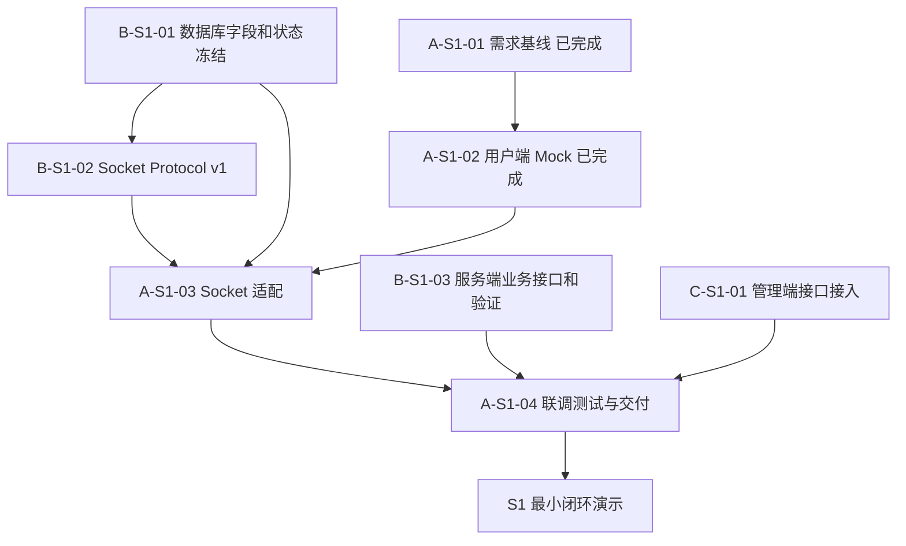
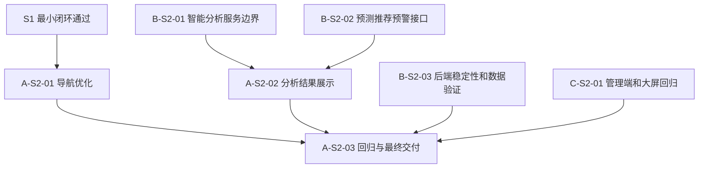

# 同学 A 用户端任务计划与交付记录

> 版本：v1.0（2026-09-02）
> 适用角色：同学 A  适用范围：阶段 I 最小闭环、阶段 II 扩展与最终交付

## 1. 目标与依据

同学 A 负责用户端及其联调交付，使用户能够从登录开始，完成站点查询、预约、充电、结算和历史记录查看，并在服务端不可用时保留可演示的 Mock/离线模式。

本计划依据以下项目事实执行：

- `docs/development-plan.md`：项目阶段、里程碑和整体依赖。
- `docs/role-c-delivery-plan.md`：三人协作边界、交付规范和 C 的接口协作方式。
- `docs/architecture/protocol.md`：B 提供的 Socket Protocol v1，是用户端字段、操作名、请求 ID、错误码和消息边界的唯一事实来源。
- qmake6 构建协议：Qt 工程、测试、验收和发布统一使用 `qmake6`，禁止使用 CMake。
- `current.md`、需求矩阵和用户端 UI 需求文档：当前状态和验收证据来源。

## 2. 角色边界

### 2.1 负责范围

- `apps/user-client` 的 Qt Widgets 页面、页面切换和用户交互。
- `IUserService` 及其 Mock、Socket 适配实现。
- 用户端对 Socket Protocol v1 的接入、错误映射、超时和断连处理。
- 用户端导航、服务端地图协议适配、Mock/离线回退；不持有腾讯地图 Key。
- 用户端 QtTest、联调测试、qmake6 构建验证和用户端交付材料。
- 用户端 README、运行命令、测试证据、录屏和个人报告素材。

### 2.2 不负责范围

- 直接访问 SQLite 或编写数据库 SQL。
- 服务端业务规则、事务、并发模型和管理员权限。
- 管理端页面、ECharts 大屏后端数据和机器学习模型。
- 独立设计 Socket 协议、数据库字段、状态枚举或服务端端口。

所有字段、状态、操作名、错误码、金额和时间格式必须跟随 B 的最新协议和数据库文档；有冲突时先登记待决事项并通知 B，不在用户端私自兼容出另一套协议。

## 3. 当前基线

- `A-S1-01` 需求基线与需求追踪：已完成。
- `A-S1-02` 用户端 Qt Widgets Mock 闭环：已完成。
- 当前用户端已覆盖登录/注册、站点和电桩查询、预约、取消预约、开始/停止充电、结算、历史记录、个人资料、余额和 Mock 导航。
- 用户端工程和 QtTest 工程已经采用 qmake6；不得恢复 CMake 构建入口。
- 用户端已完成 PR #4 快照下的真实 Socket 联调；Mock 完成不等于后端联调完成，最终跨模块回归仍归入 A-S1-04。
- 腾讯地图 API Key 由 B 服务端管理；A 端不读取、不传输、不保存 Key，只通过 Socket 获取服务端地图结果。

## 4. 阶段 I：最小业务闭环

阶段 I 截止时间：2026 年 9 月 10 日 24:00。

### A-S1-01：需求基线与任务追踪（已完成）

任务要求：

1. 阅读项目说明书、需求矩阵、用户端需求、协议和数据库文档。
2. 提取用户端用例、页面、状态、异常、优先级、阶段和来源条款。
3. 将需求映射到用户端服务接口、UI 行为和测试用例。
4. 在 `current.md`、需求矩阵和本计划中记录完成状态、证据和依赖。
5. 检查三份文档中的阶段口径，不能把 Mock 误标为真实联调完成。

验收标准：需求有来源和验收描述；证据包含需求矩阵、用户端文档、源码/测试和状态记录；未决依赖明确列出。

### A-S1-02：用户端 Mock 基线（已完成）

任务要求：

1. 使用 Qt Widgets 完成主窗口、导航和页面切换。
2. 完成登录、注册、退出登录和会话状态。
3. 完成站点列表、站点详情、电桩状态和闲置/预约/充电中/故障展示。
4. 完成预约、取消预约、开始充电、停止充电和结算流程。
5. 完成当前订单、历史记录、完成时间、地址和金额展示。
6. 完成昵称、头像、个人资料和余额 Mock 操作。
7. 提供 Mock 导航、离线路线和无服务端启动开关。
8. 业务调用全部经过 `IUserService`，用户端不直接操作 SQLite。
9. 使用 QtTest 覆盖登录、站点、电桩、预约、充电、结算和关键异常。

验收标准：qmake6 可独立构建应用和测试；QtTest 通过；无网络、无服务端时 Mock 主流程仍可演示。

### A-S1-03：Socket Protocol v1 适配与真实联调（已完成）

任务要求：

1. 逐项核对 B 的协议文档：长度前缀/消息边界、版本、请求 ID、操作名、载荷、响应和统一错误码。
2. 保持 `IUserService` 对 UI 的接口稳定，新增真实 Socket 实现或适配器。
3. 接入登录/自动注册、资料/余额、站点、电桩、预约/取消预约、开始/停止充电、结算、当前订单和历史订单请求。
4. 将协议错误码转换为可读的用户提示；禁止展示 SQL、服务器路径、内部堆栈或密钥。
5. 处理连接失败、连接超时、断连、半包/粘包、重复请求 ID和服务端错误。
6. 通过配置切换 Mock 与真实 Socket；真实接口失败时保留明确的离线降级行为。
7. 使用 B 提供的种子账号、端口、启动命令和样例完成真实请求验证。
8. 发现协议字段或错误码不足时，登记待决项并通知 B；不得自行更改协议版本。

验收标准：至少完成一次真实预约或充电订单生命周期；状态和金额正确映射；余额不足、重复订单、桩冲突、非法输入和网络失败均有稳定提示；Mock/Socket 可切换。

### A-S1-04：联调测试与阶段 I 交付（待完成）

任务要求：

1. 为 Socket 适配层编写单元测试和协议样例测试。
2. 与 B 服务端执行登录、站点查询、预约、充电、停止、结算和历史记录联调。
3. 检查余额扣减、订单状态、桩状态和完成时间在客户端与数据库之间一致。
4. 验证未完成订单阻止重复开始充电，验证服务端六类异常和连接异常。
5. 在干净目录使用 qmake6 构建应用和测试，不执行 CMake。
6. 执行 qmake6 构建、QtTest、`git diff --check`、密钥扫描、Mock 启动、Socket 联调和干净环境演示。
7. 更新用户端 README、`current.md`、本计划和证据路径。
8. 准备用户端源码包、运行说明、测试记录和阶段录屏素材。

验收标准：新克隆目录可按文档启动；真实主链路可重复演示；测试命令、环境、结果和限制可追溯；未完成功能保持准确状态。

## 5. 阶段 II：导航优化、分析展示与最终材料

阶段 II 截止时间：2026 年 9 月 17 日 24:00。

### A-S2-01：腾讯地图导航优化（已完成）

任务要求：

1. 按 PR #15 的 `docs/architecture/map-service-protocol.md` 接入服务端 `map.station.search` 和 `map.route.plan`，不得在用户端拼接腾讯 URL 或持有 Key。
2. 将当前登录用户 ID、地址/坐标起点、搜索半径、目标业务站点 ID 和驾车/步行模式映射到 v1 envelope。
3. 校验服务端响应中的站点坐标、路线距离/时间/折线、`data_source` 和 `warning`；错误码只转换为脱敏用户提示。
4. 保留 Mock/离线回退；服务端不可用、超时、地图上游失败、缓存降级或空结果时，不阻塞站点、预约和充电功能。
5. 保证地图数据只补充位置和路线，价格、桩数量、桩状态和订单始终来自 `IUserService`。
6. 增加本地协议假服务测试，并在 README 记录服务端环境变量、qmake6 构建和未完成的 B 端运行依赖。

验收标准：用户端只通过服务端获取地图站点和路线；服务端数据能安全渲染并明确区分实时、缓存、降级和 Mock；服务失败仍可使用离线路线；用户端不保存或提交腾讯密钥。当前客户端适配与本地协议测试已完成，B 的 Schema v0.4、地图 handler、腾讯上游调用和运行时审计仍待服务端实现。

### A-S2-02：智能分析结果的用户端展示（待完成）

任务要求：

1. 等待 B 冻结智能分析服务边界、请求格式和响应字段。
2. 不在用户端自行实现模型，不修改 B 的模型服务接口。
3. 增加预测负荷、低拥堵推荐和高负荷/等待风险提示的展示入口。
4. 处理服务不可用、空结果、过期结果和格式错误，降级后不影响基础充电业务。
5. 标注预测时间、数据来源或数据时间，并区分预测状态和实时桩状态。
6. 为正常结果、无结果和服务失败编写测试。

验收标准：智能分析可独立关闭；分析服务异常不阻塞站点查询、预约、充电和结算；字段与 B 的最终接口一致。

### A-S2-03：回归验证与最终交付（待完成）

任务要求：

1. 基于 B/C 最终版本执行用户端回归和跨模块状态核对。
2. 检查正常、空数据、错误数据、断连和服务重启后的页面行为。
3. 在 Ubuntu 干净环境使用 qmake6 构建应用和测试。
4. 更新 README、本计划、`current.md`、测试记录、录屏和个人报告素材。
5. 仅打包同学 A 负责的增量代码及必要说明，不包含构建产物、运行数据库、日志和敏感配置。

验收标准：用户端主流程可重复演示；qmake6 构建、测试和证据可追溯；已完成、部分完成、待完成和已知限制均明确。

## 6. 阶段依赖流程

### 阶段 I

### 阶段 II

## 7. 协作、提交和安全规则

- 所有代码或架构调整必须同步维护根目录 `current.md`，并压缩掉已无价值的历史信息。
- Socket 字段、错误码、状态和端口以 B 的最新协议文档为准。
- 用户端不直接访问 SQLite；管理端和用户端不自行定义数据库状态。
- 构建、测试、验收和发布只使用 `qmake6`，禁止使用 CMake。
- 每次协议或数据库变更都要同步更新适配层、样例、测试、README 和 `current.md`。
- 真实腾讯地图 Key 只存在本地配置；禁止提交 `.env`、构建目录、Makefile、数据库、日志和密钥。
- 提交信息包含任务编号，例如 `docs(role-a): add user-client delivery plan` 或 `A-S1-03: integrate protocol adapter`。
- 推送前执行 `git status --short`、`git diff --check`、密钥扫描和 qmake6 验证。
- PR 的 base 固定为 `main`，描述必须包含任务编号、变更范围、验证命令、依赖和已知限制。

## 8. 任务完成清单

| 任务编号 | 任务名称 | 状态 | 证据 | 依赖/备注 |
|---|---|---|---|---|
| A-S1-01 | 需求基线与任务追踪 | 已完成 | 需求矩阵、`current.md`、用户端需求文档 | 已完成 |
| A-S1-02 | 用户端 Mock 基线 | 已完成 | `apps/user-client`、README、QtTest | 不代表真实联调完成 |
| A-S1-03 | Socket Protocol v1 适配与真实联调 | 已完成 | VM qmake6：应用构建、QtTest 11/11、B smoke 与 concurrency PASS；profile/recharge、冻结策略、stop 释放和余额不足均覆盖 | A-S1-04 继续做跨模块最终回归和交付证据 |
| A-S1-04 | 联调测试与阶段 I 交付 | 待开始 | 待补充 | 依赖 A-S1-03 和 B 服务端 |
| A-S2-01 | 腾讯地图导航优化 | 已完成（客户端适配） | `server_map_service.*`、`map_service.*`、Protocol v1 假服务测试、README、`current.md` | 服务端地图 handler/Schema v0.4 待 B 完成；客户端不持有 Tencent Key |
| A-S2-02 | 智能分析结果用户端展示 | 待开始 | 待补充 | 依赖 B-S2-01/B-S2-02 |
| A-S2-03 | 回归验证与最终交付 | 待开始 | 待补充 | 依赖 A/B/C 最终版本 |

## 9. 更新记录

| 日期 | 变更 | 依据 |
|---|---|---|
| 2026-09-02 | 新增同学 A 独立任务计划，明确阶段任务、依赖、验收和交付规则 | 项目开发计划、C 角色计划、Protocol v1、qmake6 构建协议 |
| 2026-09-02 | A-S1-03 首轮 Socket 适配与真实订单生命周期联调完成，任务保持进行中 | B PR #4 提交 3600c3de81c252e3a8a37a8f8eff3e58a1a8ac13、VM qmake6、QtTest 9 passed、B smoke |
| 2026-09-04 | 按当前 main 上的 PR#4 Schema v0.3 合同完成用户端真实 Socket 适配与回归；应用构建、QtTest、B smoke/concurrency 均通过，预约和直充启动路径均已覆盖，A-S1-03 完成 | current main 994e5ff（PR #4 merged，PR #8 UI baseline included）、隔离数据库服务端、Ubuntu qmake6 |
| 2026-09-09 | 按 PR #15 新协议完成服务端地图客户端适配：`map.station.search`/`map.route.plan`、用户/站点上下文、服务端来源解析、Mock/离线回退和协议假服务测试 | 客户端不持有 Tencent Key；B 的地图 handler、Schema v0.4 和真实 Socket 联调待完成 |
